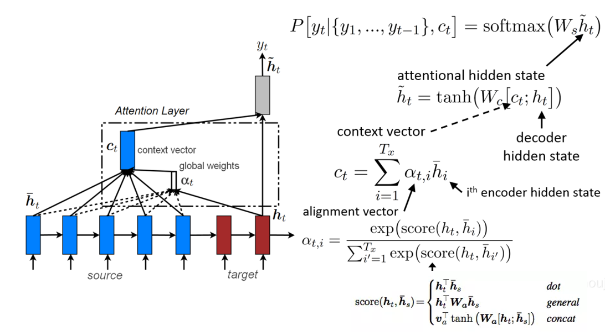
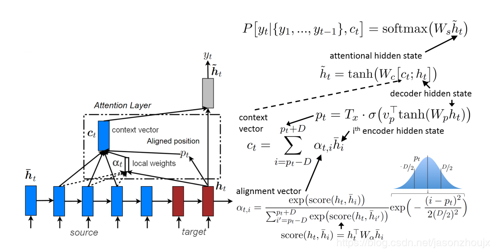
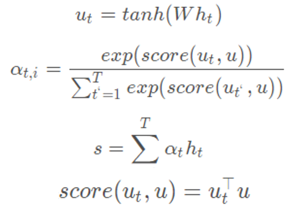

# Attention Mechanisms

Tips：这是一个简略版的Attention总结，详细版有空再做吧。

## Global Attention（处理seq2seq，具有encoder和decoder）

- 背景：输入一个N个单词的句子序列，预测下一个单词。
- 操作：
  - 产生当前时刻decoder产生的状态变量Ht，和输入句子encoder产生N个状态变量{H1,H2,...,HN}；
  
  - 计算所有状态变量{H1,H2,...,HN}的关注权重α；
  
  - 加权求和整合关注特征Ct；
  
  - 整合输出特征Ht~；
  
  - 预测概率分布P；

## Local Attention（处理seq2seq，具有encoder和decoder）

- 背景：输入一个N个单词的句子序列，预测下一个单词。
- 动机：Global在每一次生成单词时都对输入序列中所有单词进关注计算代价太高。为了缓解这个问题，可以只集中关注一个固定大小2d+1窗口中状态变量{Hp-d,Hp-d+1,...,Hp+d}
- 操作：
  - 产生当前时刻decoder产生的状态变量Ht，和输入句子encoder产生N个状态变量{H1,H2,...,HN}；
 
  - 预测最应该关注的单词所在的位置pt；
  
  - 计算2d+1窗口中各状态变量的权重系数，并用高斯函数进行加权得到α；
  
  - 对2d+1窗里的状态变量加权求和整合关注特征Ct；
  
  - 整合输出特征Ht~；
  
  - 预测概率分布P；
  
## Self Attention（处理encoder特征，不具有decoder）

- 操作：
  - 产生输入句子encoder的N个状态变量Ht{H1,H2,...,HN}；
  
  - 将H输入全连接层中，输出Ut；
  
  - 将Ut乘上Ut的转置，求得关注系数α；
  
  - 加权求和整合关注特征St；

