# GRAPH ATTENTION NETWORKS

## Abstract
1. 本文提出了一种新式的处理图结构数据的神经网络，它利用了自关注层来解决以往图卷积的缺点。
2. 通过堆叠关注层，可以隐式为一个邻域中不同节点赋予不同权重，而不需要高昂的计算量、也不需要预先知道图的结构。
3. 同时本文还解决了谱域卷积的几个关键问题，能使模型处理inductive和transductive问题。
4. 在四个数据集上取得了sota的效果，数据集包括：Cora，Citeseer，Pubmed和Protein-protein interaction。

## Introduction
1. 最近CNN被广泛应用，它所处理的数据是网格结构的，这样的结构能有效重用卷积核。然而很多任务不能被表示为网格结构，它们能表示为不规则域。例如：社交网络、生物网络等，这些通常被表达为图的形式。

2. 目前已有很多尝试将神经网络扩展到处理任意结构的图：
    - RvNN将图域中的数据表示为有向无环图。
    - GNN可以处理更一般的图类，如循环图、有向图和无向图
    - GGNN是在GNN中加入门结构
  
3. 将卷积推广到图领域是有益的，目前主流方法分类两大类：谱域卷积、非谱域卷积。

4. 谱域卷积：
    - 2014年，对图拉普拉斯算子进行特征分解，来定义傅里叶变换域的卷积操作。带来巨大的计算量。
    - 2015年，引入了光滑系数谱滤波器的参数化，使其具有空间局部化特性。
    - 2016年，提出了用拉普拉斯图的切比雪夫展开来近似滤波器，消除了计算拉普拉斯特征向量的需要。
    - 2017年，通过限制卷积核只在每个节点的一阶邻域进行操作，简化了方法。
    - 结论：上述方法需要图的拉普拉斯算子，是基于输入图结构的，不能接受不同结构的输入图。

5. 非谱域卷积：非谱域方法的难点是定义一个能在不同大小邻域上计算和保持参数共享的性质。
    - 需要学习每个节点度的特定权值矩阵，利用转换矩阵的幂来定义邻域，同时学习每个输入通道的8个权值和邻域度，或者提取包含固定数量节点的邻域并对其进行归一化
    - MoNet为图提供了一种一般化的CNN结构
    - GraphSAGE以归纳方式计算节点表示的方法。通过对每个节点的一个固定大小的邻域进行采样，然后对其执行特定的聚合操作。

6. 本文提出了基于关注的结构对图结构数据的节点进行分类：
    - 它能够通过关注每个节点的邻域来计算每个节点的隐藏表示。
    - 它的关注具有以下性质：
        - 在不同节点对中能够实现并行化。
        - 通过为邻域赋予权重，能应用到具有不同度矩阵。
        - 模型可以直接适用于归纳学习问题，包括可以推广到未知的图。
    - 在四个数据集上取得了sota的效果，数据集包括：Cora，Citeseer，Pubmed和Protein-protein interaction。

## GAT Architecture
这一部分提出了基础的关注块层，通过堆叠它可以实现对任意图的处理。并直接概述了其在神经图处理领域的理论和实践优势，和以往工作相比的局限性。
### Graph Attentional Layer

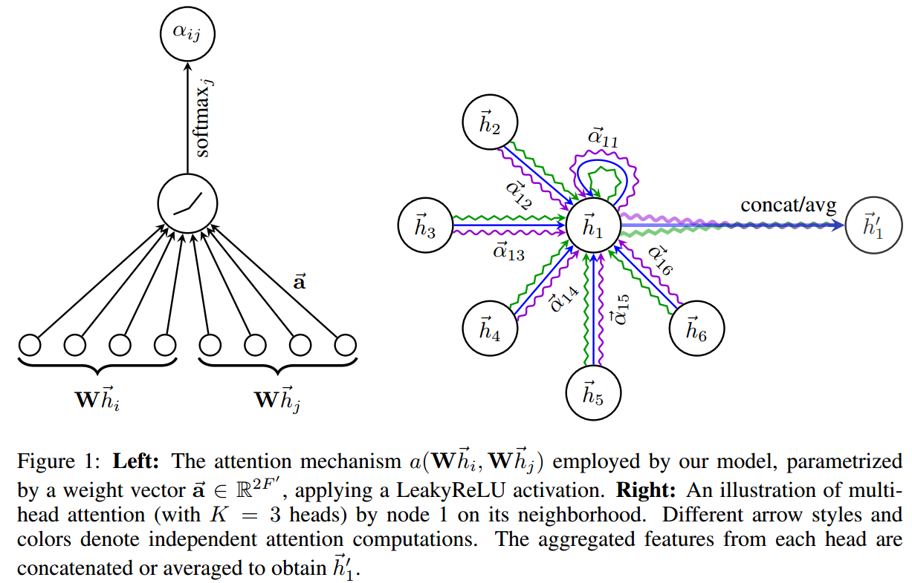

1. 第一步：为了获得足够的表达能力，需要先利用一个参数共享的全连接层对所有输入节点特征进行线性转换：

2. 第二步：将节点特征进行两两组合，再用一个全连接层a将特征映射到1-d特征。

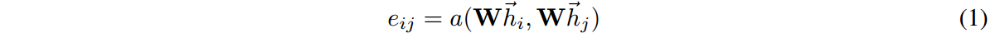

3. 第三步：对所有节点进行自关注计算，得到关注系数。常用的做法是对第i个节点，计算图中所有节点的关注系数，丢失所有的结构化信息。

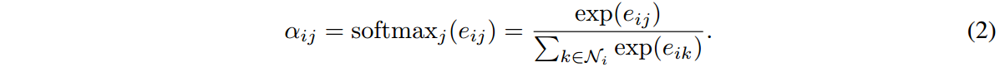

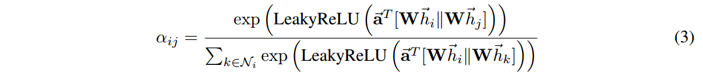

4. 第四步：常用的做法是对第i个节点，计算图中所有节点的关注系数，丢失所有的结构化信息。因此，此处只计算每个节点的一阶邻域的关注系数。聚合特征得到每个节点的最终输出。

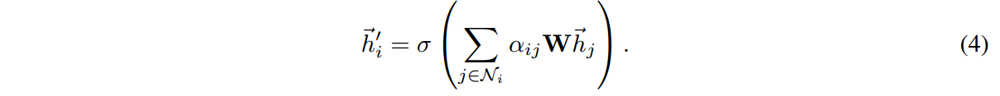

5. 第五步（多抽头关注）：为了稳定自关注机制，可以增加多抽头关注机制，即每一层引入K个自关注，最终使用串接的方式将他们整合。

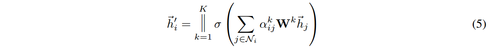

6. 第六步（多抽头关注）：最后一层的话，则使用均值的方式融合每个节点的多抽头关注特征。

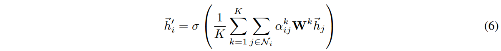

### Comparisons to related work
- 计算高效：
    - 关注层可以对所有边缘进行并行处理、输出特征可以对所有节点并行处理。
    - 不需要特征分解或者类似计算量大的矩阵操作。
    - 计算复杂度为O(VFF+EF)，V为节点数，E为边缘数，F为输入输出特征维度。
    - 计算复杂度与GCN相当。
    - 当使用K个抽头的关注时，则参数量为K倍。
- 能够隐式的为不同邻域节点赋予不同的重要程度，有效提升模型容量。还能提高模型的可解释性。
- 关注机制对图中所有边缘都是共享的，因此不需要依赖知道全局图的结构或者它的所有节点。
- 传统的方向需要指定邻域的顺序，但GAT并不需要假设顺序。
- 与传统方法相比，我们模型使用节点特征进行相似度的计算，而不是使用节点的结构性质。

## Evaluation
transductive learning：是特殊到特殊的学习，目的就是解决target domain的问题；未标注数据同时也是测试数据。
inductive learning：是特殊到一般的学习，测试数据只是用来测试这个通用模型的好坏；未标注数据只是用于帮助训练而不用于测试。
### Datasets
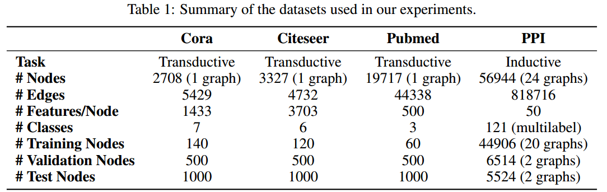
- Transductive learning:
    - 数据集：
        - Cora：2708个节点（每个节点特征数位1433-d），5429个边缘，7个类别。
        - Citeseer：3327个节点（每个节点特征数位3703-d），4732个边缘，6个类别。
        - Pubmed：19717个节点（每个节点特征数位500-d），44338个边缘，3个类别。
    - 节点为文件，节点的特征为英语文件的词袋表达，每个节点有一个类别标签。
    - 边缘为文件的引用。
    - 采用了1000个节点作为测试，500个节点作为验证。
    
- Inductive learning:
    - 数据集：protein-protein interaction
    - 具有20个图进行训练，2个图进行评价，2个图进行测试。
    - 测试集中保留了训练时完全没有见过的图。
    - 实验中对每个取2372个节点，每个节点特征为50-d。
    - 一个节点可以拥有多个类别标签，共有121个类别。

### Experimental setup
- Transductive learning:
    - 使用了两层的GAT模型。
        - 第一层：将关注抽头数量K设置为8，输出特征维度设置为8，共为64-d；后接指数非线性单元。
        - 第二层：每个关注抽头预测C维度特征（C为类别数），再用Softmax计算概率。
    - 使用了L2正则化，系数为0.0005。
    - 使用Dropout，系数为0.6。
- Inductive learning
    - 使用了三层的GAT模型。
    - 前两层：将关注抽头数量K设置为4，输出特征维度设置为256，共为1024-d；后接指数非线性单元。
    - 第三层：将关注抽头数量K设置为6，每个关注预测121个特征，求均值后输入到sigmoid进行多分类。

### Results
- Transductive learning: GCN-64\*表示隐藏层特征为64维的GCN，与GAT一致。
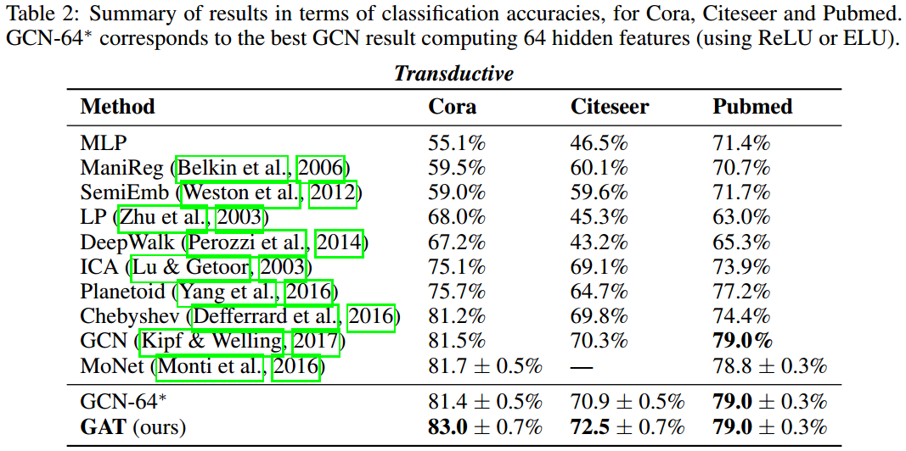

- Inductive learning
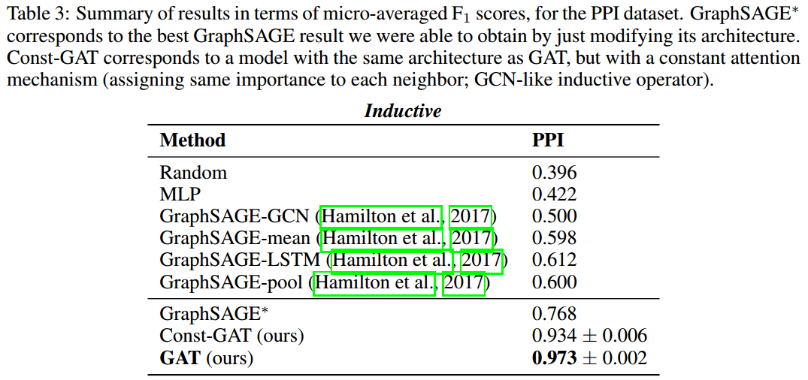

- Visualization：将Cora模型第一层输出进行2D可视化，表现出明显的集群。
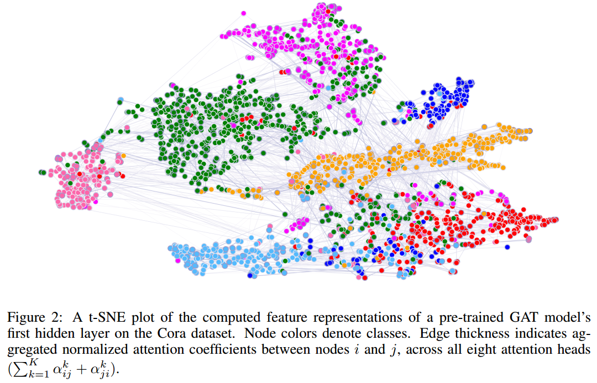

## Conclusion
- 提出了GAT网络，一种新式的在图结构数据上的卷积网络。
- 计算高效，不需要复杂的矩阵运算。
- 能为每个邻域节点赋予一个重要程度的权重系数。
- 不需要预先知道整个图的结构。
- 获取了sota的效果。
- GAT有几个潜在的改进和扩展，可以作为未来的工作来处理：
    - 克服第2.2小节中描述的实际问题，以便能够处理更大的批处理大小。
    - 利用注意机制对模型的可解释性进行深入分析。
    - 将该方法扩展到执行图分类而不是节点分类也是有意义的。
    - 将模型扩展到包含边缘特性(可能表示节点之间的关系)，这将允许我们处理更多的问题。
